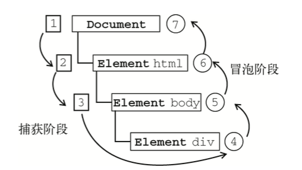

## 事件流

事件流描述的是从页面中接收事件的顺序。

### 事件冒泡

事件冒泡，即事件开始时由最具体的元素(文档中嵌套层次最深 的那个节点)接收，然后逐级向上传播到较为不具体的节点(文档)，例：

```html
<!DOCTYPE html>
<html>
<head>
    <title>Event Bubbling Example</title>
</head>
<body>
    <div id="myDiv">Click Me</div>
</body>
</html>
```


如果你单击了页面中的`<div>`元素，那么这个 click 事件会按照如下顺序传播:

1. `<div>`
2. `<body>`
3. `<html>`
4. `document`

也就是说，click 事件首先在`<div>`元素上发生，而这个元素就是我们单击的元素。然后，click 事件沿 DOM 树向上传播，在每一级节点上都会发生，直至传播到 document 对象。
所有现代浏览器都支持事件冒泡，但在具体实现上还是有一些差别。IE5.5 及更早版本中的事件冒 泡会跳过`<html>`元素(从`<body>`直接跳到 document)。IE9、Firefox、Chrome 和 Safari 则将事件一直 冒泡到 window 对象。

### 事件捕获

事件捕获(event capturing)。事件捕获的思想 是不太具体的节点应该更早接收到事件，而最具体的节点应该最后接收到事件。事件捕获的用意在于在 事件到达预定目标之前捕获它。如果仍以前面的 HTML 页面作为演示事件捕获的例子，那么单击`<div>`元素就会以下列顺序触发 click 事件。

1. `document`
3. `<html>`
4. `<body>`
5. `<div>`

在事件捕获过程中，document 对象首先接收到 click 事件，然后事件沿 DOM 树依次向下，一直传播到事件的实际目标，即`<div>`元素。
虽然事件捕获是 Netscape Communicator 唯一支持的事件流模型，但 IE9、Safari、Chrome、Opera 和 Firefox 目前也都支持这种事件流模型。尽管“DOM2 级事件”规范要求事件应该从 document 对象 开始传播，但这些浏览器都是从 window 对象开始捕获事件的。由于老版本的浏览器不支持，因此很少有人使用事件捕获。我们也建议读者放心地使用事件冒泡，在有特殊需要时再使用事件捕获。


### DOM事件流

“DOM2级事件”规定的事件流包括三个阶段:事件捕获阶段、处于目标阶段和事件冒泡阶段。首 先发生的是事件捕获，为截获事件提供了机会。然后是实际的目标接收到事件。最后一个阶段是冒泡阶 段，可以在这个阶段对事件做出响应。以前面简单的 HTML 页面为例:



在 DOM 事件流中，实际的目标(`<div>`元素)在捕获阶段不会接收到事件。这意味着在捕获阶段， 事件从 document 到`<html>`再到`<body>`后就停止了。下一个阶段是“处于目标”阶段，于是事件在`<div>`上发生，并在事件处理(后面将会讨论这个概念)中被看成冒泡阶段的一部分。然后，冒泡阶段发生， 事件又传播回文档。

多数支持 DOM 事件流的浏览器都实现了一种特定的行为;即使“DOM2 级事件”规范明确要求捕 获阶段不会涉及事件目标，但 IE9、Safari、Chrome、Firefox 和 Opera 9.5 及更高版本都会在捕获阶段触 发事件对象上的事件。结果，就是有两个机会在目标对象上面操作事件。

!> IE9、Opera、Firefox、Chrome 和 Safari 都支持 DOM 事件流;IE8 及更早版本不 支持 DOM 事件流。
