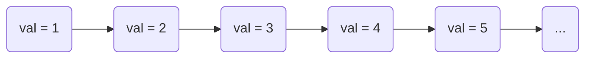
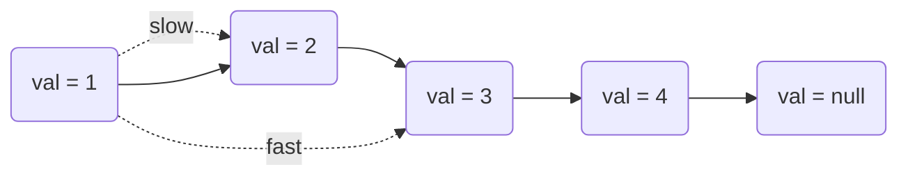
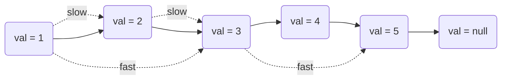

## 快慢指针

### 快慢指针说明

快慢指针指两个步长不一的指针，例如：a指针每次向前移动一位，b指针每次向前移动两位

### 快慢指针的应用

主要应用于链表结构

#### 查找有序链表中位数

求链表的中心节点的值，假设一个链表为：


数据结构为
```js
class ListNode {
    constructor (val) {
        this.val = val;
        this.next = null;
    }
}
```

设慢指针(slow)步长为1，快指针(fast)步长为慢指针的两倍即为2，两个指针的起点同为第一个节点，则:
1. 链表长度为偶数时
链表长度为偶数时，快指针无法到达链表最后一个节点，只能到达链表的倒数第二个结点；则慢指针的位置为上中位数，返回（上中位数+下中位数）/2。



2. 链表长度为奇数时
当快指针移动x次后到达表尾（1+2x）处，则慢指针的位置就是中位数



代码实现：
```js
function getMid(nodeList) {
    let slow = nodeList;
    let fast = nodeList;
    while (true) {
        if (!fast.next) { // 快指针到表尾，链表长度为奇数，则此时慢指针即为中位数位置
            return slow.val;
        } else if (!fast.next.next) { // 快指针到倒数第二位，链表长度为偶数数，则此时慢指针即为上中位数位置
            return (slow.val + slow.next.val) / 2
        } else {
            fast = fast.next.next;
            slow = slow.next;
        }
    }
}
```

#### 回文链表检测

> 见leecode: [234. 回文链表](https://leetcode-cn.com/problems/palindrome-linked-list/)

请判断一个链表是否为回文链表。

示例 1:
```
输入: 1->2
输出: false
```
示例 2:
```
输入: 1->2->2->1
输出: true
```

解答： 
```js
/**
 * Definition for singly-linked list.
 * function ListNode(val) {
 *     this.val = val;
 *     this.next = null;
 * }
 */
/**
 * @param {ListNode} head
 * @return {boolean}
 */
var isPalindrome = function(head) {
    if (!head || !head.next) {
        return true;
    }
    let slow = head;
    let fast = head;
    let stack = [], val;
    while (true) {
        val = slow.val;
        if (!fast.next) { // 慢指针为中间位置
            break;    
        } else if (!fast.next.next) {
            stack.push(val);
            break;
        } else {
            stack.push(val);
            slow = slow.next;
            fast = fast.next.next;
        }
    }
    while(stack.length) {
        val = stack.pop();
        slow = slow.next;
        if (val !== slow.val) {
            return false;
        }
    }
    return true;
};
```
