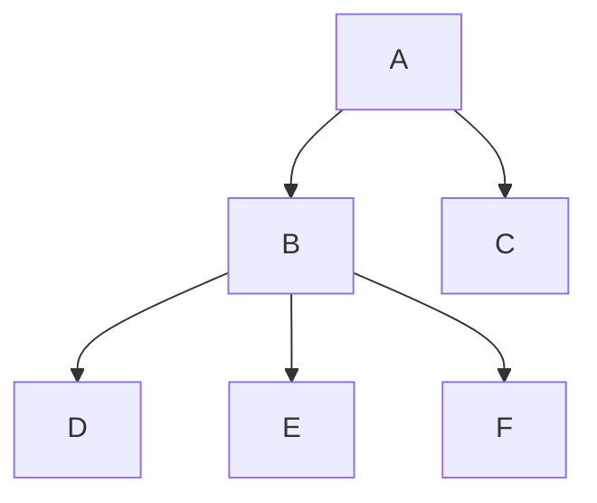
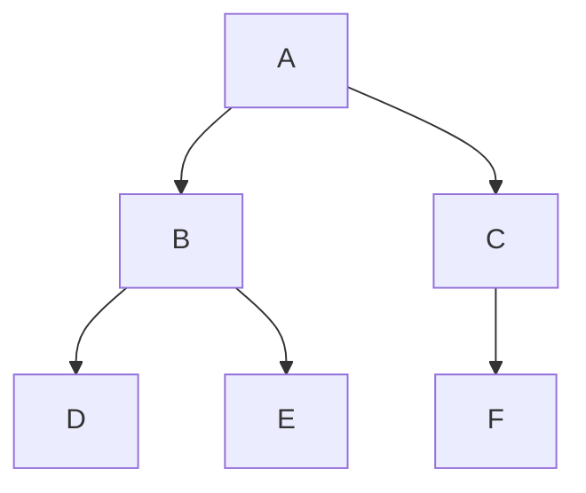

# 数据结构-树

> [百度百科-树](https://baike.baidu.com/item/%E6%A0%91/2699484?fr=aladdin)



树状图是一种数据结构，它是由n（n>=1）个有限结点组成一个具有层次关系的集合。把它叫做“树”是因为它看起来像一棵倒挂的树，也就是说它是根朝上，而叶朝下的。它具有以下的特点：
1. 每个结点有零个或多个子结点；
2. 没有父结点的结点称为根结点；
3. 每一个非根结点有且只有一个父结点；
4. 除了根结点外，每个子结点可以分为多个不相交的子树；


## 各种树的定义

> [数据结构-各种树的定义](https://blog.csdn.net/u014532217/article/details/79118023)


### 术语

```
节点深度：对任意节点x，x节点的深度表示为根节点到x节点的路径长度。所以根节点深度为0，第二层节点深度为1，以此类推
节点高度：对任意节点x，叶子节点到x节点的路径长度就是节点x的高度
树的深度：一棵树中节点的最大深度就是树的深度，也称为高度
父节点：若一个节点含有子节点，则这个节点称为其子节点的父节点
子节点：一个节点含有的子树的根节点称为该节点的子节点
节点的层次：从根节点开始，根节点为第一层，根的子节点为第二层，以此类推
兄弟节点：拥有共同父节点的节点互称为兄弟节点
度：节点的子树数目就是节点的度
叶子节点：度为零的节点就是叶子节点
祖先：对任意节点x，从根节点到节点x的所有节点都是x的祖先（节点x也是自己的祖先）
后代：对任意节点x，从节点x到叶子节点的所有节点都是x的后代（节点x也是自己的后代）
森林：m颗互不相交的树构成的集合就是森林
```

#### 二叉树
树的任意节点至多包含两棵子树。
#### 满二叉树
叶子节点都在同一层并且除叶子节点外的所有节点都有两个子节点。
#### 二叉查找树（二叉搜索树、BST）
若任意节点的左子树不空，则左子树上所有节点的值均小于它的根节点的值；
若任意节点的右子树不空，则右子树上所有节点的值均大于它的根节点的值；
任意节点的左、右子树也分别为二叉查找树；

特性：通过中序遍历二叉搜索树得到的关键码序列是一个递增序列。

## 常用算法
以二叉树为例，树的数据结构为：
```js
class TreeNode {
    constructor (val, left, right) { // 其中val为节点值，left、right分别为左右节点
        this.val = val;
        this.left = left;
        this.right = right;
    }
}
```


上图的数据结构即为：
```js
let tree = new TreeNode('A', new TreeNode('B', new TreeNode('D', null, null), new TreeNode('E', null, null)), new TreeNode('C', new TreeNode('F', null, null), null))
// 即
tree = {
   "val": "A",
   "left": {
       "val": "B",
       "left": {
           "val": "D",
           "left": null,
           "right": null
       },
       "right": {
           "val": "E",
           "left": null,
           "right": null
       }
   },
   "right": {
       "val": "C",
       "left": {
           "val": "F",
          "left": null,
          "right": null
       },
       "right": null
   }
}
```
### 二叉树前序遍历
前序遍历（Preorder Traversal, DLR），是二叉树遍历的一种，也叫做先根遍历、先序遍历、前序周游，可记做根左右。前序遍历首先访问根结点然后遍历左子树，最后遍历右子树。如上图，则结果应为：ABDECF

1. 递归实现

```js
function dlr (node) {
    if (!node) { //  为null返回
        return;
    }
    let {val, left, right} = node;
    console.log(val);
    dlr(left);
    dlr(right);
}
```

2. 非递归实现
```js
function dlr (node) {
    if (!node) { //  为null返回
        return;
    }
    let stack = [node]; // 辅助栈
    while (stack.length) {
        let {val, left, right} = stack.pop();
        console.log(val);
        right && stack.push(right); // 右节点先入栈
        left && stack.push(left);
    }
}
```

### 二叉树中序遍历
中序遍历（Inorder Traversal, LDR）是二叉树遍历的一种，也叫做中根遍历、中序周游。在二叉树中，中序遍历首先遍历左子树，然后访问根结点，最后遍历右子树。以上图为例，结果应为：DBEAFC
1. 递归算法
```js
function ldr (node) {
    if (!node) { //  为null返回
        return;
    }
    let {val, left, right} = node;
    ldr(left);
    console.log(val);
    ldr(right);
}
```
2. 非递归算法
```js
function ldr(node) {
    let p = node; // 指针
    let stack = []; // 辅助栈
    while (p || stack.length) {
        while (p) {
            stack.push(p);
            p = p.left;
        }
        p = stack.pop();
        console.log(p.val);
        p = p.right;
    }
}

// 给定从left节点回溯的标识
function ldr (node) {
     if (!node) { //  为null返回
         return;
     }
     let stack = [node]; // 辅助栈
     while (stack.length) {
         let last = stack[stack.length - 1]; // 栈顶位置
         let {val, left, right, status} = last; // 用status标识返回到当前节点左节点是否已检测通过，status = left
         switch (status) {
             case 'left': { // 左侧节点返回的，则出栈，查看是否有右侧节点，若有入栈
                console.log(val);
                stack.pop();
                right && stack.push(right);
                break;
             }
             default: { // 若无标识则表示首次到达该节点需要先遍历左右节点，当前项status置为left，先遍历左侧节点，若有左节点则左节点入栈
                 last.status = 'left';
                 left && stack.push(left);
             }
         }
     }
 }
```

### 二叉树后序遍历
后序遍历（Postorder Traversal ，LRD）是二叉树遍历的一种，也叫做后根遍历、后序周游，可记做左右根。后序遍历有递归算法和非递归算法两种。在二叉树中，先左后右再根，即首先遍历左子树，然后遍历右子树，最后访问根结点。以上图为例，结果应为：DEBFCA
1. 递归算法
```js
function lrd (node) {
    if (!node) { //  为null返回
        return;
    }
    let {val, left, right} = node;
    lrd(left);
    lrd(right);
    console.log(val);
}
```

2. 非递归算法
后序遍历的非递归算法是三种顺序中最复杂的，原因在于，后序遍历是先访问左、右子树,再访问根节点，而在非递归算法中，利用栈回退到时，并不知道是从左子树回退到根节点，还是从右子树回退到根节点，如果从左子树回退到根节点，此时就应该去访问右子树，而如果从右子树回退到根节点，此时就应该访问根节点。所以相比前序和后序，必须得在压栈时添加信息，以便在退栈时可以知道是从左子树返回，还是从右子树返回进而决定下一步的操作。
```js
function lrd (node) {
     if (!node) { //  为null返回
         return;
     }
     let stack = [node]; // 辅助栈
     while (stack.length) {
         let last = stack[stack.length - 1]; // 栈顶位置
         let {val, left, right, status} = last; // 用status标识返回到当前节点是左节点还是右节点，status = left|right
         switch (status) {
             case 'right': { // 右侧节点返回的，则当前已遍历完左右节点，输出当前项，出栈
                 console.log(val);
                 stack.pop();
                 break;
             }
             case 'left': { // 左侧节点返回的，则需要查看是否有右侧节点，若有则将status置为right，若无则直接输出当前项
                 last.status = 'right';
                 right && stack.push(right);
                 break;
             }
             default: { // 若无标识则表示首次到达该节点需要先遍历左右节点，当前项status置为left，先遍历左侧节点，若有左节点则左节点入栈
                 last.status = 'left';
                 left && stack.push(left);
             }
         }
     }
 }
```
