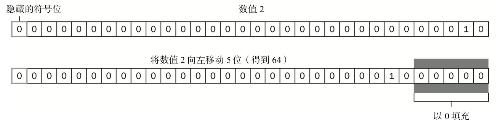

## 位运算符 ～、&、|
* 位操作符用于在最基本的层次上，即按内存中表示数值的位来操作数值。ECMAScript 中的所有数 值都以 IEEE-754 64 位格式存储，但位操作符并不直接操作 64 位的值。而是先将 64 位的值转换成 32 位 的整数，然后执行操作，最后再将结果转换回 64 位。对于开发人员来说，由于 64 位存储格式是透明的， 因此整个过程就像是只存在 32 位的整数一样。<br/>
* 对于有符号的整数，32 位中的前 31 位用于表示整数的值。第 32 位用于表示数值的符号:0 表示正 数，1 表示负数。这个表示符号的位叫做符号位，符号位的值决定了其他位数值的格式。其中，正数以 纯二进制格式存储，31 位中的每一位都表示 2 的幂。第一位(叫做位 0)表示 20，第二位表示 21，以此 9 类推。没有用到的位以 0 填充，即忽略不计。例如，数值 18 的二进制表示是 00000000000000000000000000010010，或者更简洁的 10010。这是 5 个有效位，这 5 位本身就决定了实 际的值.<br/>
* 负数同样以二进制码存储，但使用的格式是二进制补码。计算一个数值的二进制补码，需要经过下 列 3 个步骤:

```
(1) 求这个数值绝对值的二进制码(例如，要求18 的二进制补码，先求 18 的二进制码); 
(2) 求二进制反码，即将 0 替换为 1，将 1 替换为 0;
(3) 得到的二进制反码加 1。
要根据这 3 个步骤求得18 的二进制码，首先就要求得 18 的二进制码，即:
    0000 0000 0000 0000 0000 0000 0001 0010
然后，求其二进制反码，即 0 和 1 互换: 1111 1111 1111 1111 1111 1111 1110 1101 最后，二进制反码加 1:
    1111 1111 1111 1111 1111 1111 1110 1101
                                          1
    ---------------------------------------
    1111 1111 1111 1111 1111 1111 1110 1110
这样，就求得了-18 的二进制表示，即 11111111111111111111111111101110。要注意的是，在处理有 符号整数时，是不能访问位 31 的。
ECMAScript 会尽力向我们隐藏所有这些信息。换句话说，在以二进制字符串形式输出一个负数时， 我们看到的只是这个负数绝对值的二进制码前面加上了一个负号。如下面的例子所示:
    var num = -18;
    alert(num.toString(2));    // "-10010"
要把数值18 转换成二进制字符串时，得到的结果是"-10010"。这说明转换过程理解了二进制补 码并将其以更合乎逻辑的形式展示了出来。
在 ECMAScript 中，当对数值应用位操作符时，后台会发生如下转换过程:64 位的数值被转换成 32 位数值，然后执行位操作，最后再将 32 位的结果转换回 64 位数值。
这样，表面上看起来就好像是在操 作 32 位数值，就跟在其他语言中以类似方式执行二进制操作一样。但这个转换过程也导致了一个严重 的副效应，
即在对特殊的 NaN 和 Infinity 值应用位操作时，这两个值都会被当成 0 来处理。
如果对非数值应用位操作符，会先使用 Number()函数将该值转换为一个数值(自动完成)，然后 再应用位操作。得到的结果将是一个数值。
```

!> 默认情况下，ECMAScript 中的所有整数都是有符号整数。不过，当然也存在无 符号整数。对于无符号整数来说，第 32 位不再表示符号，因为无符号整数只能是正 数。而且，无符号整数的值可以更大，因为多出的一位不再表示符号，可以用来表示 数值。

1. 按位非(NOT)，即`~`,执行按位非的结果就是返回数值的反码
```
var num1 = 25; // 二进制00000000000000000000000000011001
var num2 = ~num1; // 二进制11111111111111111111111111100110
alert(num2); // -26
```
这里，对 25 执行按位非操作，结果得到了26。这也验证了按位非操作的本质:操作数的负值减 1。 因此，下面的代码也能得到相同的结果:
```
var num1 = 25;
var num2 = -num1 - 1;
alert(num2);            // "-26"
```
虽然以上代码也能返回同样的结果，但由于按位非是在数值表示的最底层执行操作，因此速度更快。   
 
取反（〜）运算符对 -1 以外的任何值，都返回 truthy 值。对它进行非运算，直接 !〜

2.  按位与(AND),将两 个数值的每一位对齐，然后根据下表中的规则，对相同位置上的两个数执行 AND 操作:

|第一数值位|第二数值位|结果|
|:-:|:-:|:-:|
|1|1|1|
|1|0|0|
|0|1|0|
|0|0|0|

简而言之，按位与操作只在两个数值的对应位都是 1 时才返回 1，任何一位是 0，结果都是 0。 下面看一个对 25 和 3 执行按位与操作的例子:
```
var result = 25 & 3; 
alert(result); //1
可见，对 25 和 3 执行按位与操作的结果是 1。为什么呢?请看其底层操作: 
 25 = 0000 0000 0000 0000 0000 0000 0001 1001
  3 = 0000 0000 0000 0000 0000 0000 0000 0011 
------------------------------------------------
AND = 0000 0000 0000 0000 0000 0000 0000 0001
原来，25 和 3 的二进制码对应位上只有一位同时是 1，而其他位的结果自然都是 0，因此最终结果 等于 1。
```

3.  按位或(OR),按位或操作遵循下面这个真值表。

|第一数值位|第二数值位|结果|
|:-:|:-:|:-:|
|1|1|1|
|1|0|1|
|0|1|1|
|0|0|0|

由此可见，按位或操作在有一个位是 1 的情况下就返回 1，而只有在两个位都是 0 的情况下才返回 0。 
如果在前面按位与的例子中对 25 和 3 执行按位或操作，则代码如下所示:

```
var result = 25 | 3;
alert(result);       //27
25 与 3 按位或的结果是 27:
25 = 0000 0000 0000 0000 0000 0000 0001 1001 
 3 = 0000 0000 0000 0000 0000 0000 0000 0011 
-------------------------------------------- 
OR = 0000 0000 0000 0000 0000 0000 0001 1011
这两个数值的都包含 4 个 1，因此可以把每个 1 直接放到结果中。二进制码 11011 等于十进制值 27。
```

4. 按位异或(XOR) 按位异或操作符由一个插入符号(^)表示，也有两个操作数。以下是按位异或的真值表。

|第一数值位|第二数值位|结果|
|:-:|:-:|:-:|
|1|1|0|
|1|0|1|
|0|1|1|
|0|0|0|

按位异或与按位或的不同之处在于，这个操作在两个数值对应位上只有一个 1 时才返回 1，如果对 应的两位都是 1 或都是 0，则返回 0。
对 25 和 3 执行按位异或操作的代码如下所示:

```
var result = 25 ^ 3;
alert(result);    //26
25 与 3 按位异或的结果是 26，其底层操作如下所示:
  25 = 0000 0000 0000 0000 0000 0000 0001 1001 
  3  = 0000 0000 0000 0000 0000 0000 0000 0011 
 --------------------------------------------- 
 XOR = 0000 0000 0000 0000 0000 0000 0001 1010
BitwiseXorExample01.htm
  这两个数值都包含 4 个 1，但第一位上则都是 1，因此结果的第一位变成了 0。而其他位上的 1 在另 一个数值中都没有对应的 1，可以直接放到结果中。二进制码 11010 等于十进制值 26(注意这个结果比 执行按位或时小 1)。
```

5. 左移(<<)
左移操作符由两个小于号(<<)表示，这个操作符会将数值的所有位向左移动指定的位数。例如， 如果将数值 2(二进制码为 10)向左移动 5 位，结果就是 64(二进制码为 1000000)，代码如下所示:
```js
var oldValue = 2; // 等于二进制的10
var newValue = oldValue << 5; // 等于二进制的1000000，十进制的64
```
注意，在向左移位后，原数值的右侧多出了 5 个空位。左移操作会以 0 来填充这些空位，以便得到 的结果是一个完整的 32 位二进制数


注意，左移不会影响操作数的符号位。换句话说，如果将-2 向左移动 5 位，结果将是-64，而非 64。
