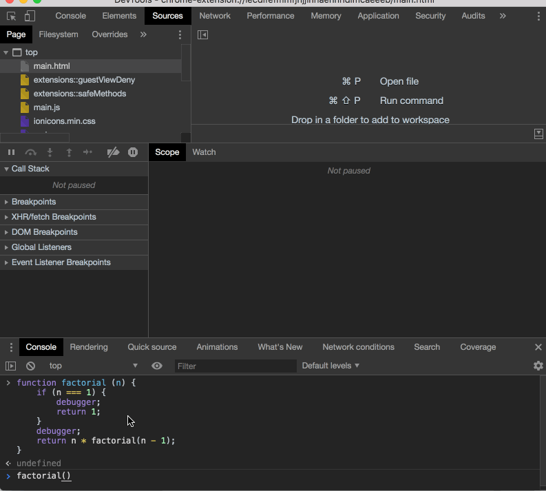

## 递归
递归函数是指直接或间接调用函数本身，则该函数称为递归函数。

```js
// 求n的阶乘
function factorial (n) {
    if (n === 1) {
        return 1;
    }
    return n * factorial(n - 1);
}
// js中还可以这样
function factorial (n) {
    if (n === 1) {
        return 1;
    }
    // arguments.callee指向的是函数本身
    return n * arguments.callee(n - 1);
}
```

递归过程中，函数在调用的时候会在调用栈（call stack）中存有记录，每一条记录叫做一个调用帧（call frame），每调用一个函数，就向栈中push一条记录，函数执行结束后依次向外弹出，直到清空调用栈，每个函数在调用另一个函数的时候，并没有 return 该调用，所以JS引擎会认为你还没有执行完，会保留你的调用帧。通过chrome的控制台可以很清晰的看到这个过程




### 尾递归

> 详见： [http://es6.ruanyifeng.com/#docs/function#%E5%B0%BE%E8%B0%83%E7%94%A8%E4%BC%98%E5%8C%96](http://es6.ruanyifeng.com/#docs/function#%E5%B0%BE%E8%B0%83%E7%94%A8%E4%BC%98%E5%8C%96)

当一个函数尾调用自身，就叫做尾递归。
```js
// 求n的阶乘
function factorial (n, res = 1) {
    if (n === 1) {
        debugger;
        return res;
    }
    debugger;
    return factorial(n - 1, res * n);
}
```
尾递归的实现，往往需要改写递归函数，确保最后一步只调用自身。要做到这一点，需要把函数内部所有用到的中间变量改写为函数的参数，就像上面的factorial()函数改写一样。

!> 注意，目前只有 Safari 浏览器支持尾调用优化，Chrome 和 Firefox 都不支持。
