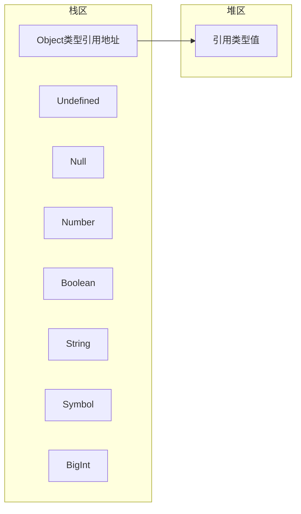
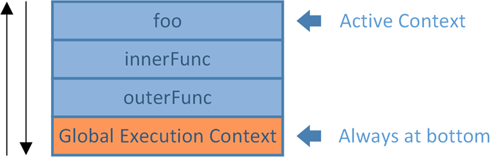

## 基本类型和引用类型

> [MDN-JavaScript 数据类型和数据结构](https://developer.mozilla.org/zh-CN/docs/Web/JavaScript/Data_structures)

ECMAScript 变量可能包含两种不同数据类型的值:基本类型值和引用类型值。基本类型值指的是 简单的数据段，而引用类型值指那些可能由多个值构成的对象。
其中基本类型是按值访问的，可以操作保存在变量中的实际的值：`undefined`、`null`、`number`、`boolean`、`string`、`symbol`(es6新增)、`BigInt`(提案阶段)；
引用类型是保存在内存中的对象，引用类型的值是按引用访问的：`Function`、`Object`(`Array`、`Date`、`RegExp`)

!> 除 Object 以外的所有类型都是不可变的（值本身无法被改变）,我们称这些类型的值为“原始值”。


## 类型检测

### typeof

|类型|举例|
|:-|:-|
|Null|`typeof(null)` => `object`|
|Number|`typeof(1)` => `number`|
|Boolean|`typeof(true)` => `boolean`|
|String|`typeof('test')` => `string`|
|Symbol|`typeof(Symbol())` => `symbol`|
|BigInt|`typeof(BigInt("9007199254740995"))` => `bigint`|
|Object|`typeof({})` => `object`|
|Function|`typeof (()=>{})` => `function`|
|Array|`typeof([])` => `object`|

!> 使用typeof操作符检测函数时，该操作符会返回"function"。在Safari 5及 之前版本和 Chrome 7 及之前版本中使用 typeof 检测正则表达式时，由于规范的原 因，这个操作符也返回"function"。ECMA-262 规定任何在内部实现[[Call]]方法 的对象都应该在应用 typeof 操作符时返回"function"。由于上述浏览器中的正则 表达式也实现了这个方法，因此对正则表达式应用 typeof 会返回"function"。在 IE 和 Firefox 中，对正则表达式应用 typeof 会返回"object"。

检测基本数据类型时 `typeof`表现没有问题，但在检测引用类型的值时无法检测它是什么类型的对象。为此，ECMAScript 提供了 `instanceof` 操作符

### instanceof

instanceof 运算符用来检测 constructor.prototype 是否存在于参数 object 的原型链上。详见MDN：[instanceof](https://developer.mozilla.org/zh-CN/docs/Web/JavaScript/Reference/Operators/instanceof)

语法
```
object instanceof constructor
```
根据规定，所有引用类型的值都是 Object 的实例。因此，在检测一个引用类型值和 Object 构造 函数时，instanceof 操作符始终会返回 true。当然，如果使用 instanceof 操作符检测基本类型的 值，则该操作符始终会返回 false，因为基本类型不是对象。

```js
// 基本数据类型不能被instanceof精准判断
2 instanceof Number// false
true instanceof Boolean // false
'str' instanceof String// false  

(new Object) instanceof Object // true
true instanceof Object // true
[] instanceof Array // true
null instanceof Object // false
```

instanceof 操作符的问题在于，它假定只有一个全局执行环境。如果网页中包含多个框架，那实际上就存在两个以上不同的全局执行环境，从而存在两个以上不同版本的 Array 构造函数。如果你从一个框架向另一个框架传入一个数组，那么传入的数组与在第二个框架中原生创建的数组分别具有各自不同的构造函数。为了解决这个问题，ECMAScript 5 新增了 `Array.isArray()`方法。这个方法的目的是最终确定某个值到底是不是数组，而不管它是在哪个全局执行环境中创建的。
```js
Array.isArray([]) // true
```

instanceof是根据它的原型链来识别类型的，若原型链被修改(当然一般也不会这么做)则：
```js
let a = [];
a.__proto__ = Object; // __proto__详见：https://developer.mozilla.org/zh-CN/docs/Web/JavaScript/Reference/Global_Objects/Object/proto
a instanceof Array // false
```
### Object.prototype.toString

`Object.prototype.toString`表示该对象的字符串。每个对象都有一个 `toString()`` 方法，当该对象被表示为一个文本值时，或者一个对象以预期的字符串方式引用时自动调用。默认情况下，toString() 方法被每个 Object 对象继承。如果此方法在自定义对象中未被覆盖，toString() 返回 "[object type]"，其中 type 是对象的类型。
还是上边的例子
```js
let a = [];
a.__proto__ = Object;
Object.prototype.toString.call(a) // "[object Array]"

Object.prototype.toString.call(undefined) // "[object Undefined]"
Object.prototype.toString.call(null) // "[object Null]"
(function (){console.log(Object.prototype.toString.call(arguments))})() // "[object Arguments]"
```

封装一个获取传入变量类型的函数：
```js
function getType (t) {
    return Object.prototype.toString.call(t).match(/^\[object\s{1}(.*)]$/)[1].toLowerCase();
}
```

|类型|举例|
|:-|:-|
|Null|`getType(null)` => `null`|
|Number|`getType(1)` => `number`|
|Boolean|`getType(true)` => `boolean`|
|String|`getType('test')` => `string`|
|Symbol|`getType(Symbol())` => `symbol`|
|BigInt|`getType(BigInt("9007199254740995"))` => `bigint`|
|Object|`getType({})` => `object`|
|Function|`getType(()=>{})` => `function`|
|Array|`getType([])` => `array`|
|Arguments|`(function() {console.log(getType(arguments))})()` => `arguments`|
|Math|`getType(Math)` => `Math`|
|Date|`getType(new Date)` => `date`|
|NodeList|`getType(document.querySelectorAll('div'))` => `nodelist`|

因此我们可以封装一个函数,判断当前的变量是否是我们想要的类型
```js
function isType (t, type) {
    return Object.prototype.toString.call(t) === `[object ${type}]`;
}
isType([], 'Array'); // true
```

## 不可变的原始值和可变的对象引用
JavaScript的值可分为：
* 原始值(`undefined`、`null`、`boolean`、`number`、`string`,`symbol`、`bigint`)：存储在栈（stack）中的简单数据段，也就是说，它们的值直接存储在变量访问的位置。（js中的valueOf()）。原始值是不可更改的：任何方法都无法更改一个原始值。原始值的比较是值的比较：只有他们的值相等时它们才相等。
* 引用值(数组、对象等)：存储在堆（heap）中的对象，也就是说，存储在变量处的值是一个指针（point），指向存储对象的内存处。引用值可以变更：通过修改其属性；引用值的比较均是引用的比较：当且仅当它们引用同一个基对象时才相等。

## 变量声明

JavaScript 引擎在执行一段可执行代码之前，会先进行准备工作，也就是对这段代码进行解析（也可以称为预处理）。这个阶段会根据可执行代码创建相应的执行上下文（ Execution Context ），也就是做声明提升等工作。然后在代码解析完成后才开始代码的执行。

```js
var a;
var b;

var a, b;

var a = 1, b = 2;
var c = 3;
```

> `var`、`let`、`const` 的异同

* 同一个作用域内`var`声明变量可重复用`var`声明, 但`let`、`const` 不可重复定义；
* 在全局作用域内使用var声明一个变量，变量会挂载到 window（实际上是定义了全局对象的一个属性）,不可以通过`delete`删除；而通过let、const声明则不会挂载到 window,且不能通过delete删除；
* var 声明的变量存在变量提升，而 let、const 则不存在；
* let、const声明形成块作用域
* const 一旦声明必须赋值,不能使用 null 占位。如果声明的是基本类型声明后不能再修改，如果声明的是复合类型数据，可以修改其属性
* 暂存死区

```
var a = 100;

if (1) {
  a = 10;
  //在当前块作用域中存在a使用let/const声明的情况下，给a赋值10时，只会在当前作用域找变量a，
  // 而这时，还未到声明时候，所以控制台
  // Error:a is not defined
  let a = 1;
}
```

!> 在`es5`严格模式下，给一个没有声明的变量赋值会报错，在非严格模式下，给一个未声明的变量赋值，JavaScript实际上会给全局对象创建一个同名属性，并且像一个正确声明全局变量工作（但并不完全一样，这个变量是全局对象的可配值属性，可以通过`delete`删除）。

```js
aa = 1;
var bb = 2;
delete aa; // => true
delete bb; // => false,
```
## 执行环境

> [深入理解之执行上下文](http://cavszhouyou.top/JavaScript%E6%B7%B1%E5%85%A5%E7%90%86%E8%A7%A3%E4%B9%8B%E6%89%A7%E8%A1%8C%E4%B8%8A%E4%B8%8B%E6%96%87.html#more)


执行环境(execution context）,也叫执行上下文，定义了变量或函数有权访问的其他数据，决定了它们各自的行为，每个执行上下文都由三个属性组成：变量对象（Variable object，VO）、作用域链(Scope chain)、this。

执行上下文栈执行每一段可执行代码时都会对应创建一个执行上下文，JavaScript 引擎创建了执行上下文栈（Execution context stack，ECS）来管理执行上下文。

```
var a = "global var";

function foo(){
    console.log(a);
}

function outerFunc(){
    var b = "var in outerFunc";
    console.log(b);

    function innerFunc(){
        var c = "var in innerFunc";
        console.log(c);
        foo();
    }

    innerFunc();
}

outerFunc();
```

代码首先进入Global Execution Context，然后依次进入outerFunc，innerFunc和foo的执行上下文，执行上下文栈就可以表示为：

JavaScript 开始要解释执行代码的时候，最先遇到的就是全局代码，所以 JavaScript 引擎会先解析创建全局执行上下文，然后将全局执行上下文压栈。然后当执行流进入一个函数时，会先解析创建函数的执行上下文，然后将它的执行上下文压栈。而在函数执行之后，会将其执行上下文弹栈，弹栈后执行上下文中所有的数据都会被销毁，然后把控制权返回给之前的执行上下文。注意，全局执行上下文会一直留在栈底，直到整个应用结束。

### 变量对象（Variable object，VO）

> [深入理解之变量对象](http://cavszhouyou.top/JavaScript%E6%B7%B1%E5%85%A5%E7%90%86%E8%A7%A3%E4%B9%8B%E5%8F%98%E9%87%8F%E5%AF%B9%E8%B1%A1.html)

变量对象（Variable object，VO）是与执行上下文相关的数据作用域，存储了在执行上下文中定义的所有变量和函数声明，保证代码执行时对变量和函数的正确访问。
简单的来它说存储着执行上下文中的以下内容：

* 函数的所有形参(如果是函数执行上下文)
   * 由名称和对应值组成，作为变量对象的属性被创建
   * 没有实参，属性值设为 undefined
* 函数声明
   * 由名称和对应值（函数对象(function-object)，指向对函数的引用）组成，作为变量对象的属性被创建
   * 如果变量对象已经存在相同名称的属性，则完全替换这个属性
* 变量声明
   * 由名称和对应值（undefined）组成，作为变量对象的属性被创建
   * 如果变量名称跟已经声明的形式参数或函数相同，则变量声明不会干扰已经存在的这类属性

#### 不同执行上下文中的变量对象

不同执行上下文中的变量对象是不同的，根据可执行代码的不同我们可以将执行上下文分为两种，一种是全局执行上下文，一种是函数执行上下文。因此我们也可以将变量对象分为对应的两种，一种是全局上下文变量对象，一种是函数上下文变量对象。那么它们和变量对象是什么关系呢？可以这样理解：
```
抽象变量对象VO (变量初始化过程的一般行为)
  ║
  ╠══> 全局上下文变量对象GlobalContextVO，等同于全局对象
  ║        (VO === this === global)
  ║
  ╚══> 函数上下文变量对象FunctionContextVO，等同于活动对象（Variable object，VO）
           (VO === AO, 并且添加了<arguments>和<formal parameters>)
```
变量对象其实只是一个抽象的基本事物，它规定了一些基本的操作（如变量初始化）和行为，不同执行上下文中的不同实现都是基于这些行为来创建的。其实不必太过纠结于这个概念，我们只需要记住在全局执行上下文中我们通过全局对象来代表全局上下文变量对象，在函数上下文中我们通过活动对象来代表函数上下文变量对象。

### 作用域

> [JavaScript深入理解之作用域链](http://cavszhouyou.top/JavaScript%E6%B7%B1%E5%85%A5%E7%90%86%E8%A7%A3%E4%B9%8B%E4%BD%9C%E7%94%A8%E5%9F%9F%E9%93%BE.html)

每个执行环境都有一个与之关联的变量对象(variable object)，环境中定义的所有变量和函数都保存在这个对象中。虽然我们编写的代码无法访问这个对象，但解析器在处理数据时会在后台使用它。

* 全局变量：在全局定义的变量，执行环境是全局
* 局部变量：在函数体內定义的变量，执行环境是局部性的

当代码在一个环境中执行时，会创建变量对象的一个作用域链(scope chain)。作用域链的用途，是 保证对执行环境有权访问的所有变量和函数的有序访问。作用域链的前端，始终都是当前执行的代码所在环境的变量对象。如果这个环境是函数，则将其活动对象(activation object)作为变量对象。活动对象在最开始时只包含一个变量，即 arguments 对象(这个对象在全局环境中是不存在的)。作用域链中 的下一个变量对象来自包含(外部)环境，而再下一个变量对象则来自下一个包含环境。这样，一直延 续到全局执行环境;全局执行环境的变量对象始终都是作用域链中的最后一个对象。

> 函数作用域的创建步骤：
1. 函数形参的声明。
2. 函数变量的声明，函数变量会覆盖以前声明过的同名声明。
3. 普通变量的声明。
4. 函数内部的this指针赋值
5. 函数内部代码开始执行！

> javascript中作用域有：全局作用域、函数作用域、块级作用域(ES6新增)

!> 作用域是可访问变量的集合。
!> 1. 作用域是一个函数在执行时期的执行环境，每一个函数在执行的时候都有着其特有的执行环境。

2. 变量的作用域遵循就近原则，即局部变量优先级高于全局变量；局部变量的会优先选取最近的函数作用域;若在整个作用域链都未找到变量，则抛出引用错误(ReferenceError)异常。

### 声明提前(变量提升)
JavaScript的函数作用域是指在函数內声明的所有变量（使用`var`声明的变量）在函数体內始终是可见的。这意味着变量在声明之前甚至已经可用。
这个特性被称为声明提前（hoisting），即JavaScript函数里声明的所有变量（但不涉及赋值）都被"提前"至函数体的顶部
!> 声明提前，这步操作是在JavaScript引擎"预编译"时进行的，是在代码开始运行之前

### 作用域链(scope chain)
因为作用域是一个函数在执行时期的执行环境，每一个函数在执行的时候都有着其特有的执行环境。而在JS中，函数的可以允许嵌套的。即，在一个函数的内部声明另一个函数。
这种函数作用域的嵌套就组成了所谓的函数作用域链。当在自身作用域内找不到该变量的时候，会沿着作用域链逐步向上查找，若在全局作用域内部仍找不到该变量，则会抛出异常。

#### 延长作用域链
有些语句可以在作用域链的前端临时增加一个变量对象，该变量对象会在代码执行后被移除。在两种情况下会发生这种现象：
1. try-catch 语句的 catch 块;
2.  with 语句。
这两个语句都会在作用域链的前端添加一个变量对象。对with语句来说，会将指定的对象添加到作用域链中。对 catch 语句来说，会创建一个新的变量对象，其中包含的是被抛出的错误对象的声明。 下面看一个例子。

```js
function buildUrl() {
    var qs = "?debug=true";
    with(location){ // 接收的是 location 对象，因此其变量对象中就包含了 location 对象的所有属 性和方法，而这个变量对象被添加到了作用域链的前端。
        var url = href + qs; // 实际引用的是 location.href
    }
    return url;
}
```

!> IE8即在 catch 语句中捕获的错误对象会被添加到执行环境的变量对象，而不是 catch 语句,即使是在 catch 块的外部也可以访问到错误对象。IE9修复了这个问题。

### 作用域链与闭包
Javascript采用词法作用域，也就是说，函数的执行以来于变量作用域，这个作用域是在函数定义时决定的，而不是函数调用时决定的。Javascript函数对象的内部状态不仅包含函数的代码逻辑，还必须引用当前的作用域链。函数对象可以通过作用域链相互关联起来，函数体内部的变量都可以保存在函数作用域內，这种特性在计算机科学文献中称为"闭包"。
从技术角度讲所有的Javascript函数都是闭包：它们都是对象，它们都关联到作用域。简单的理解闭包：函数定义时的作用域链到函数执行时依然有效。

### 垃圾回收
Javascript具有自动垃圾收集机制，也就是说，执行环境会负责管理代码执行过程中使用的内存。其原理：找出那些不再继续使用的变量，然后释放其占用的内存。为此，垃圾收集器会按照固定的时间间隔(或代码执行中预定的收集时间)
，周期性的执行这一操作。通常使用的策略有：标记清除、引用计数。
#### 标记清除
垃圾收集器在运行的时候会给存储在内存中的所有变量都加上标记（当然，可以使用任何标记方式）。然后，它会去掉环境中的变量以及被环境中的变量引用的标记。而在此之后被加上标记的变量将视为准备删除的变量，原因是***环境中的变量已经无法访问到这些变量***。最后，垃圾收集器完成***内存清除***工作，销毁那些带标记的值并回收它们所占用的内存空间。
到 2008 年为止，IE、Firefox、Opera、Chrome 和 Safari 的 JavaScript 实现使用的都是标记清除式的 垃圾收集策略(或类似的策略)，只不过垃圾收集的时间间隔互有不同。
#### 引用计数
引用计数的含义是跟踪记录每 个值被引用的次数。当声明了一个变量并将一个引用类型值赋给该变量时，则这个值的引用次数就是 1。 如果同一个值又被赋给另一个变量，则该值的引用次数加 1。相反，如果包含对这个值引用的变量又取 得了另外一个值，则这个值的引用次数减 1。当这个值的引用次数变成 0 时，则说明没有办法再访问这 个值了，因而就可以将其占用的内存空间回收回来。这样，当垃圾收集器下次再运行时，它就会释放那 些引用次数为零的值所占用的内存。
引用计数策略有一个严重的问题：***循环引用***。循环引用指的是对象 A 中包含一个指向对象 B 的指针，而对象 B 中也包含一个指向对象 A 的 引用。例：
```js
function problem(){
    var objectA = new Object();
    var objectB = new Object();
    objectA.someOtherObject = objectB;
    objectB.anotherObject = objectA;
}
```
objectA 和 objectB 通过各自的属性相互引用;也就是说，这两个对象的引用次 数都是 2。在采用标记清除策略的实现中，由于函数执行之后，这两个对象都离开了作用域，因此这种 相互引用不是个问题。但在采用引用计数策略的实现中，当函数执行完毕后，objectA 和 objectB 还 将继续存在，因为它们的引用次数永远不会是 0。假如这个函数被重复多次调用，就会导致大量内存得 不到回收。
#### 内存优化
确保占用最少的内存可以让页面获得更好的性能。而优化内存占用的最佳方式，就是为执行 3 中的代码只保存必要的数据。一旦数据不再有用，最好通过将其值设置为`null`来释放其引用——这个 做法叫做解除引用(dereferencing)。这一做法适用于大多数全局变量和全局对象的属性。局部变量只在函数执行的过程中存在。而在 这个过程中，会为局部变量在栈(或堆)内存上分配相应的空间，以便存储它们的值。然后在函数中使用这些变量，直至函数执行结束。此时，局部变量就没有存在的必要了，因此可以释放它们的内存以供将来使用。
